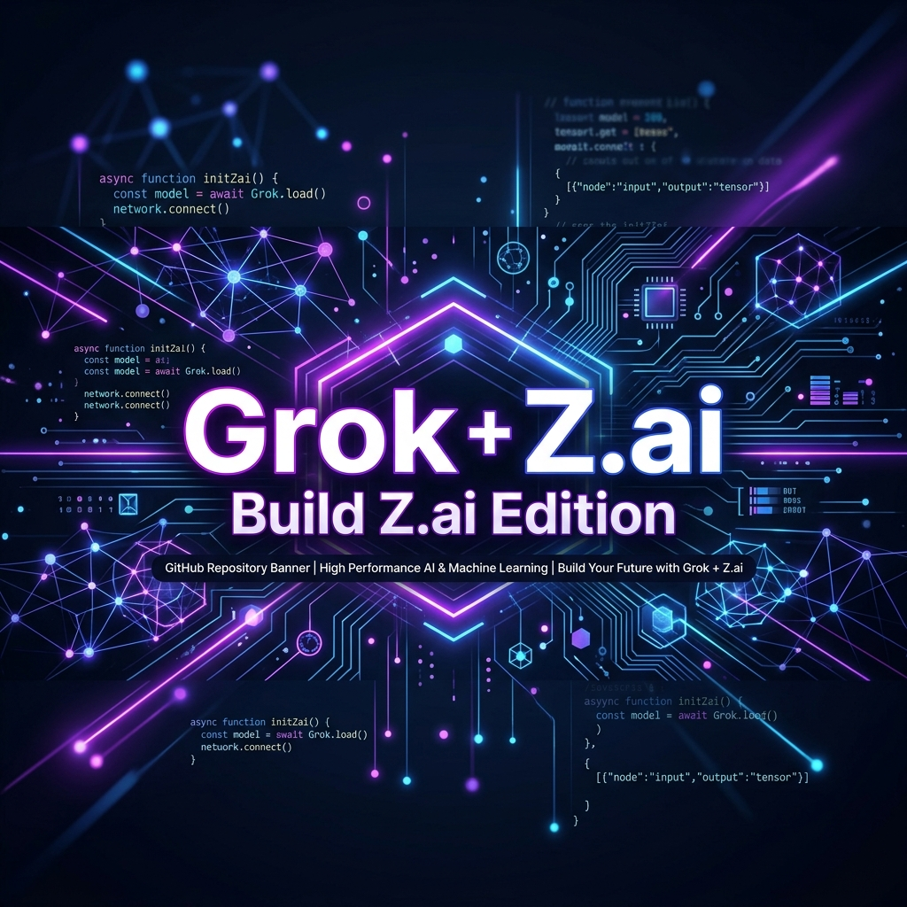
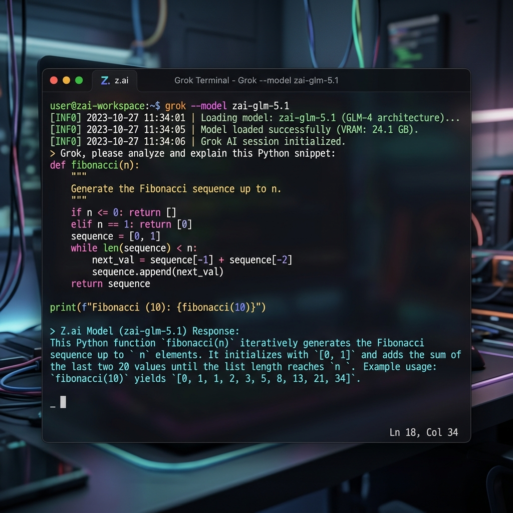

<div align="center">



# 🚀 Grok Build Z.ai Edition
**Use Any AI Provider with Grok Build CLI — No Subscription Required!**

[](VERSION)
[](LICENSE)
[](docs/models.md)
[](#installation)

Unlock the full power of your **Grok Build CLI** using **ANY OpenAI-compatible AI provider** (such as DeepSeek, Anthropic, or local LLMs like Ollama), or take advantage of our perfectly tuned **Z.ai’s state-of-the-art GLM models**. Bypass expensive default subscriptions and leverage custom coding plans locally.

---

### 🔥 Get 10% OFF Z.ai Coding Plans!
**Use invite code: `ROK78RJKNW`**

[](https://z.ai/subscribe?ic=ROK78RJKNW)
**[Click here to subscribe and save 10% on your Z.ai coding plan!](https://z.ai/subscribe?ic=ROK78RJKNW)**

---

</div>

<br>

## 🌟 What is Grok Build Z.ai Edition?

**Grok Build Z Edition** is a powerful, pre-configured setup designed to transform the Grok Build CLI into an open ecosystem. It seamlessly integrates **custom AI providers** and **cost-effective coding plans**, specifically tailored for **Z.ai's GLM models**—the ultimate alternative to x.ai's default offerings. 

By taking advantage of Z.ai's OpenAI-compatible API endpoints, you get state-of-the-art AI programming assistant capabilities directly in your terminal, all **without requiring an x.ai subscription**.

<div align="center">
  
  <p><i>A seamless, high-performance coding experience directly in your terminal.</i></p>
</div>

---

## ⚡ Supported Models & Custom AI Providers

**You are not locked into one ecosystem!** While this edition is perfectly tuned for Z.ai out-of-the-box, you can seamlessly connect **ANY OpenAI-compatible AI provider** (such as DeepSeek, Anthropic via proxies, local LM Studio, or Ollama) just by changing the `base_url` and `api_key` in your configuration.

For our primary Z.ai integration, here are the cutting-edge GLM models supported:

| Model ID | Name | Best For |
| :--- | :--- | :--- |
| 🧠 `glm-5.1` | **GLM-5.1** | General coding, complex tasks, and architectural design |
| ⚖️ `glm-5` | **GLM-5** | Balanced performance for everyday programming |
| 🚀 `glm-5-turbo` | **GLM-5 Turbo** | Ultra-fast responses and rapid prototyping |
| 👁️ `glm-5v-turbo` | **GLM-5V Turbo** | Multimodal tasks and vision-based analysis |
| 🛡️ `glm-4.7` | **GLM-4.7** | Highly stable and reliable legacy coding tasks |
| ⚡ `glm-4.7-flash` | **GLM-4.7 Flash** | Ultra-fast, lightweight script execution |
| 🖼️ `glm-4.6v` | **GLM-4.6V** | Vision and multimodal parsing |

---

## 🛠️ Installation

Get started in seconds!

### Prerequisites
- Grok Build CLI installed (`~/.grok/downloads/grok-linux-x86_64` or equivalent)
- Configure your custom AI provider endpoint/token/model
- Bash shell (Linux/macOS) or Git Bash (Windows)

<details>
<summary><b>🚀 Quick Install (Recommended)</b></summary>
<br>

```bash
# Clone the repository
git clone https://github.com/roman-ryzenadvanced/grok-build-zai-edition.git
cd grok-build-zai-edition

# Run the install script
chmod +x scripts/install.sh
./scripts/install.sh
```
</details>

<details>
<summary><b>⚙️ Manual Installation</b></summary>
<br>

1. Copy the configuration file:
   ```bash
   cp config/config.toml ~/.grok/config.toml
   ```
2. Edit `~/.grok/config.toml` and replace the API key with your own:
   ```toml
   api_key = "your-zai-api-key-here"
   ```
3. Restart the Grok Build CLI.
</details>

---

## 💻 Usage

### 🚀 Start Grok with Z.ai Models

```bash
# Use the default model (GLM-5.1)
grok

# Specify a model explicitly
grok --model zai-glm-5.1
grok --model zai-glm-5-turbo
grok --model zai-glm-4.7-flash
```

### 🤖 Headless Mode

Run automated tasks without interactive prompts:

```bash
# Single prompt with Z.ai model
grok -p "Explain this code" --model zai-glm-5.1

# Auto-approve all tool executions
grok -p "Fix all lint errors" --model zai-glm-5 --always-approve
```

---

## 🔧 Configuration & Architecture

### Configuration
The configuration is securely stored in `~/.grok/config.toml`. Key settings include:

```toml
[models]
default = "zai-glm-5.1"  # Default model

[model.zai-glm-5.1]
model = "glm-5.1"
base_url = "https://api.z.ai/api/coding/paas/v4"
api_key = "your-zai-token"
```
*See [docs/setup.md](docs/setup.md) for full configuration reference.*

### How It Works

1. Grok Build CLI's `config.toml` supports custom model definitions via `[model.<name>]` sections.
2. Each model section specifies: `base_url`, `model`, `api_key`, and optional parameters.
3. The CLI routes API requests to the specified `base_url` instead of the default x.ai endpoint.
4. Z.ai's API is OpenAI-compatible, meaning all requests work seamlessly natively.

**No binary modification, reverse engineering, or auth bypass is required.** This is a **fully supported feature** of the CLI.

---

## 📚 Documentation

Dive deeper into the ecosystem:

| Document | Description |
|----------|-------------|
| 📖 **[Setup Guide](docs/setup.md)** | Detailed installation and configuration |
| 🧠 **[Models Reference](docs/models.md)** | Complete model documentation and tuning |
| ❓ **[FAQ](docs/faq.md)** | Frequently asked questions |
| 🚑 **[Troubleshooting](docs/troubleshooting.md)** | Common issues and solutions |
| 📝 **[Changelog](CHANGELOG.md)** | Version history and upcoming features |

---

<details>
<summary><b>🚑 Troubleshooting</b></summary>
<br>

**CLI still shows subscription menu**
- *Root Cause*: The Grok Build CLI checks x.ai subscription status before loading models.
- *Solution*: Navigate through the menu, or use headless mode (`grok -p "..."`).

**401 Unauthorized from Z.ai**
- *Root Cause*: Invalid or expired API token.
- *Solution*: Verify your token in `~/.grok/config.toml`.

**Model not found**
- *Root Cause*: Model ID mismatch.
- *Solution*: Run `grok models` to see available models.

*See [docs/troubleshooting.md](docs/troubleshooting.md) for more.*
</details>

<details>
<summary><b>🧪 Testing</b></summary>
<br>

```bash
# Run all tests
python3 tests/test_config.py
python3 tests/test_models.py
python3 tests/test_connectivity.py
```
</details>

---

## 🤝 Contributing

Contributions make the open-source community an amazing place to learn, inspire, and create. Any contributions you make are **greatly appreciated**. Please open an issue or submit a pull request!

## 📜 License

This project is licensed under the MIT License - see the [LICENSE](LICENSE) file for details.

## ⚠️ Disclaimer

This project is **not affiliated with** xAI or Grok Build. It is a community-driven configuration that leverages the CLI's built-in support for custom model endpoints. Use of Z.ai's API is subject to their terms of service.

---

<div align="center">

**🔥 [Get 10% OFF Z.ai with code ROK78RJKNW](https://z.ai/subscribe?ic=ROK78RJKNW) 🔥**

*Designed for high performance. Built for the community.* <br>
Made with ❤️ by **[Rommark.Dev](https://github.com/roman-ryzenadvanced)**

</div>
