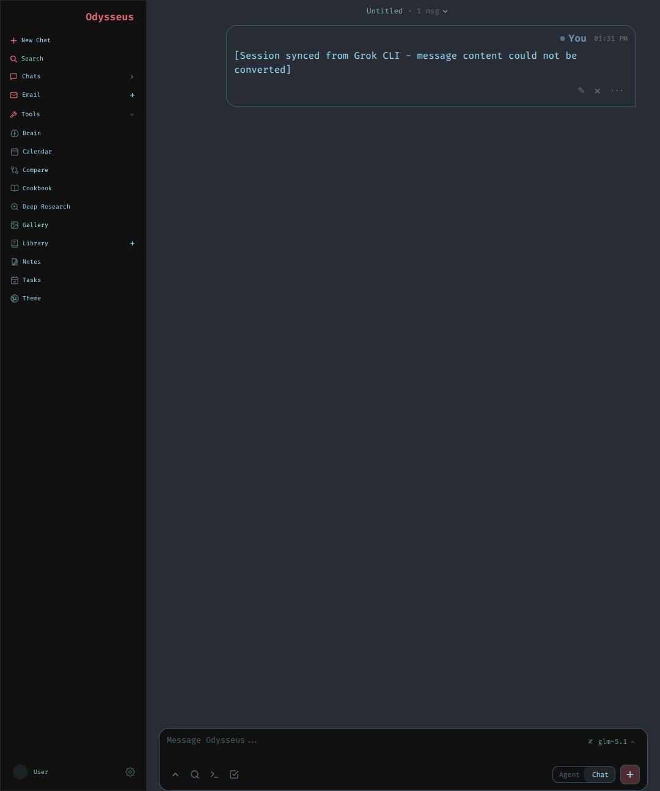

<div align="center">


# 🚀 Grok Build Z.ai Edition
**Use Any AI Provider with Grok Build CLI — No Subscription Required!**

[](VERSION)
[](LICENSE)
[](docs/models.md)
[](#installation)

Unlock the full power of your **Grok Build CLI** using **ANY OpenAI-compatible AI provider** (such as DeepSeek, Anthropic, or local LLMs like Ollama), or take advantage of our perfectly tuned **Z.ai's state-of-the-art GLM models**. Bypass expensive default subscriptions and leverage custom coding plans locally.

---

<br>
<table align="center">
  <tr>
    <td align="center" width="9999">
      <h3>�� Unlock 10% OFF Z.ai Coding Plans! 🔥</h3>
      <p>Supercharge your Grok Build CLI with ultra-fast, premium GLM models at a discount.</p>
      <p>Use Invite Code: <b><code>ROK78RJKNW</code></b></p>
      <a href="https://z.ai/subscribe?ic=ROK78RJKNW">
        
      </a>
    </td>
  </tr>
</table>
<br>


</div>

<br>

## 🌟 What is Grok Build Z.ai Edition?

**Grok Build Z Edition** is a powerful, pre-configured setup designed to transform the Grok Build CLI into an open ecosystem. It seamlessly integrates **custom AI providers** and **cost-effective coding plans**, specifically tailored for **Z.ai's GLM models**—the ultimate alternative to x.ai's default offerings. 

By taking advantage of Z.ai's OpenAI-compatible API endpoints, you get state-of-the-art AI programming assistant capabilities directly in your terminal, all **without requiring an x.ai subscription**.

<div align="center">
  
  <p><i>A seamless, high-performance coding experience directly in your terminal.</i></p>
</div>

**🆕 New in v2.0:** A complete **local web GUI** powered by [Odysseus](https://github.com/pewdiepie-archdaemon/odysseus) — see the [Web GUI](#-web-gui-odysseus) section below.

---

## ⚡ Supported Models & Custom AI Providers

**You are not locked into one ecosystem!** While this edition is perfectly tuned for Z.ai out-of-the-box, you can seamlessly connect **ANY OpenAI-compatible AI provider** (such as DeepSeek, Anthropic via proxies, local LM Studio, or Ollama) just by changing the `base_url` and `api_key` in your configuration.

For our primary Z.ai integration, here are the cutting-edge GLM models supported:

| Model ID | Name | Best For |
| :--- | :--- | :--- |
| 🧠 `glm-5.1` | **GLM-5.1** | General coding, complex tasks, and architectural design |
| ⚖️ `glm-5` | **GLM-5** | Balanced performance for everyday programming |
| 🚀 `glm-5-turbo` | **GLM-5 Turbo** | Ultra-fast responses and rapid prototyping |
| 👁️ `glm-5v-turbo` | **GLM-5V Turbo** | Multimodal tasks and vision-based analysis |
| 🛡️ `glm-4.7` | **GLM-4.7** | Highly stable and reliable legacy coding tasks |
| ⚡ `glm-4.7-flash` | **GLM-4.7 Flash** | Ultra-fast, lightweight script execution |
| 🖼️ `glm-4.6v` | **GLM-4.6V** | Vision and multimodal parsing |

---

## 🛠️ Installation

Get started in seconds!

### Prerequisites
- Grok Build CLI installed (`~/.grok/downloads/grok-linux-x86_64` or equivalent)
- Configure your custom AI provider endpoint/token/model
- Bash shell (Linux/macOS) or Git Bash (Windows)

<details>
<summary><b>🚀 Quick Install (Recommended)</b></summary>
<br>

```bash
# Clone the repository
git clone https://github.com/roman-ryzenadvanced/grok-build-zai-edition.git
cd grok-build-zai-edition

# Run the install script
chmod +x scripts/install.sh
./scripts/install.sh
```
</details>

<details>
<summary><b>⚙️ Manual Installation</b></summary>
<br>

1. Copy the configuration file:
   ```bash
   cp config/config.toml ~/.grok/config.toml
   ```
2. Edit `~/.grok/config.toml` and replace the API key with your own:
   ```toml
   api_key = "your-zai-api-key-here"
   ```
3. Restart the Grok Build CLI.
</details>

---

## 💻 Usage

### 🚀 Start Grok with Z.ai Models

```bash
# Use the default model (GLM-5.1)
grok

# Specify a model explicitly
grok --model zai-glm-5.1
grok --model zai-glm-5-turbo
grok --model zai-glm-4.7-flash
```

### 🤖 Headless Mode

Run automated tasks without interactive prompts:

```bash
# Single prompt with Z.ai model
grok -p "Explain this code" --model zai-glm-5.1

# Auto-approve all tool executions
grok -p "Fix all lint errors" --model zai-glm-5 --always-approve
```

---

## 🖥️ Web GUI (Odysseus)

A powerful, self-hosted web chat interface powered by **[Odysseus](https://github.com/pewdiepie-archdaemon/odysseus)** — a FastAPI-based AI workspace that replaces the old Next.js/CopilotKit GUI.



### Why Odysseus?

Odysseus is a full-featured AI workspace (think self-hosted ChatGPT/Claude UI) that integrates seamlessly with Grok Build's OpenAI-compatible API model system. It provides:

- **Multi-model chat** with any OpenAI-compatible provider (Z.ai GLM, Ollama, OpenRouter, etc.)
- **Agent mode** with tool use (MCP, shell, files, web search, memory)
- **Deep Research** — multi-step source gathering + visual reports
- **Document editor** with AI assistance (markdown, HTML, CSV)
- **Session management** with persistent chat history (SQLite)
- **Streaming responses** via Server-Sent Events (SSE)
- **Mobile-friendly** responsive design + PWA support
- **Dark/Light themes** with a built-in theme editor
- **File uploads** (vision, PDF parsing)
- **Memory & Skills** system for persistent agent context

### How It Syncs with Grok Build

```
┌─────────────────────────────────────────────────────┐
│                   Your Browser                      │
│              http://localhost:3000                   │
│                  (Odysseus Frontend)                 │
└───────────────────┬─────────────────────────────────┘
                    │  HTTP / SSE
                    ▼
┌─────────────────────────────────────────────────────┐
│              Odysseus Backend (FastAPI)              │
│            gui/app.py → uvicorn :3000               │
│                                                     │
│  ┌──────────────────────────────────────────┐       │
│  │        Model Endpoints (SQLite DB)        │       │
│  │  ┌────────────────────────────────────┐  │       │
│  │  │  Z.ai GLM Endpoint                 │  │       │
│  │  │  URL: https://api.z.ai/.../v4     │  │       │
│  │  │  Models: glm-5, glm-5-turbo, ...   │  │       │
│  │  └────────────────────────────────────┘  │       │
│  └──────────────────────────────────────────┘       │
│                     │                                │
│         OpenAI-compatible /v1/chat/completions       │
│                     │                                │
└─────────────────────┼────────────────────────────────┘
                      │
                      ▼
        ┌───────────────────────────────┐
        │     Z.ai API (Remote Cloud)    │
        │   Same endpoint as Grok CLI     │
        │   https://api.z.ai/api/coding  │
        │          /paas/v4               │
        └───────────────────────────────┘
```

**The key insight:** Both **Grok Build CLI** and **Odysseus Web GUI** share the same Z.ai API endpoint and models. They are two interfaces to the same AI backend:

| Feature | Grok Build CLI | Odysseus Web GUI |
|---------|---------------|------------------|
| Interface | Terminal (TUI) | Browser (Web UI) |
| AI Backend | Z.ai API (`config.toml`) | Z.ai API (Model Endpoints DB) |
| Models | `~/.grok/config.toml` | SQLite `model_endpoints` table |
| Streaming | NDJSON stdout | HTTP SSE |
| Tool Use | Built-in agent tools | MCP + built-in tools |
| Session Mgmt | `~/.grok/sessions/` | SQLite `app.db` |
| Best For | Coding, file ops, git work | Chat, research, documents |

When you configure your Z.ai API key in both places, you get a **unified experience** — code in the terminal with Grok, chat/research in the browser with Odysseus, all using the same GLM models.

### GUI Quick Start

```bash
# Navigate to the gui directory
cd gui

# Create virtual environment & install dependencies
python3 -m venv .venv
source .venv/bin/activate
pip install -r requirements.txt

# Copy environment config
cp .env.example .env
# Edit .env: set OPENAI_API_KEY=your-zai-key, APP_PORT=3000

# Run first-time setup (creates DB, admin account)
python setup.py

# Start the server
uvicorn app:app --host 127.0.0.1 --port 3000
# Open http://localhost:3000 in your browser
```

**Or use Docker:**
```bash
cd gui
cp .env.example .env
docker compose up -d --build
# Open http://localhost:7000
```

After starting, go to **Settings → Endpoints** and add your Z.ai endpoint:
- **Name:** `Z.ai GLM`
- **Base URL:** `https://api.z.ai/api/coding/paas/v4`
- **API Key:** your Z.ai token
- **Models:** `glm-5`, `glm-5.1`, `glm-5.2`, `glm-5-turbo`, `glm-5v-turbo`, `glm-4.7`, `glm-4.7-flash`, `glm-4.6v`

### GUI Tech Stack

- [FastAPI](https://fastapi.tiangolo.com/) (Python async web framework)
- [Uvicorn](https://www.uvicorn.org/) (ASGI server)
- [SQLAlchemy](https://www.sqlalchemy.org/) (ORM / SQLite persistence)
- Static HTML/CSS/JS frontend (no Node.js build step required!)
- OpenAI-compatible `/v1/chat/completions` API integration
- MCP (Model Context Protocol) for extensible tool use

See [gui/README.md](gui/README.md) for full Odysseus documentation.

## 🔧 Configuration & Architecture

### Configuration
The configuration is securely stored in `~/.grok/config.toml`. Key settings include:

```toml
[models]
default = "zai-glm-5.1"  # Default model

[model.zai-glm-5.1]
model = "glm-5.1"
base_url = "https://api.z.ai/api/coding/paas/v4"
api_key = "your-zai-token"
```
*See [docs/setup.md](docs/setup.md) for full configuration reference.*

### How It Works

1. Grok Build CLI's `config.toml` supports custom model definitions via `[model.<name>]` sections.
2. Each model section specifies: `base_url`, `model`, `api_key`, and optional parameters.
3. The CLI routes API requests to the specified `base_url` instead of the default x.ai endpoint.
4. Z.ai's API is OpenAI-compatible, meaning all requests work seamlessly natively.
5. The Odysseus Web GUI uses the same endpoint via its **Model Endpoints** system — add your Z.ai endpoint once in Settings, and it works across all chat sessions.

**No binary modification, reverse engineering, or auth bypass is required.** This is a **fully supported feature** of the CLI.

---

## 📚 Documentation

Dive deeper into the ecosystem:

| Document | Description |
|----------|-------------|
| �� **[Setup Guide](docs/setup.md)** | Detailed installation and configuration |
| 🧠 **[Models Reference](docs/models.md)** | Complete model documentation and tuning |
| ❓ **[FAQ](docs/faq.md)** | Frequently asked questions |
| 🚑 **[Troubleshooting](docs/troubleshooting.md)** | Common issues and solutions |
| 📝 **[Changelog](CHANGELOG.md)** | Version history and upcoming features |
| 🖥️ **[Web GUI Guide](gui/README.md)** | Odysseus web GUI documentation |

---

<details>
<summary><b>🚑 Troubleshooting</b></summary>
<br>

**CLI still shows subscription menu**
- *Root Cause*: The Grok Build CLI checks x.ai subscription status before loading models.
- *Solution*: Navigate through the menu, or use headless mode (`grok -p "..."`).

**401 Unauthorized from Z.ai**
- *Root Cause*: Invalid or expired API token.
- *Solution*: Verify your token in `~/.grok/config.toml`.

**Model not found**
- *Root Cause*: Model ID mismatch.
- *Solution*: Run `grok models` to see available models.

**GUI won't start (port already in use)**
- *Root Cause*: Another process is using port 3000 (or 7000 for Docker).
- *Solution*: Kill the existing process: `fuser -k 3000/tcp`, or change `APP_PORT` in `.env`.

**GUI shows no models after setup**
- *Root Cause*: No endpoints configured in Odysseus database.
- *Solution*: Go to Settings → Endpoints → Add Endpoint with your Z.ai credentials.

*See [docs/troubleshooting.md](docs/troubleshooting.md) for more.*
</details>

<details>
<summary><b>🧪 Testing</b></summary>
<br>

```bash
# Run all tests
python3 tests/test_config.py
python3 tests/test_models.py
python3 tests/test_connectivity.py
```
</details>

---

## 🤝 Contributing

Contributions make the open-source community an amazing place to learn, inspire, and create. Any contributions you make are **greatly appreciated**. Please open an issue or submit a pull request!

## 📜 License

This project is licensed under the MIT License - see the [LICENSE](LICENSE) file for details.

## ⚠️ Disclaimer

This project is **not affiliated with** xAI or Grok Build. It is a community-driven configuration that leverages the CLI's built-in support for custom model endpoints. Use of Z.ai's API is subject to their terms of service.

The web GUI ([Odysseus](https://github.com/pewdiepie-archdaemon/odysseus)) is licensed under the MIT License — see [gui/LICENSE](gui/LICENSE).

---

<div align="center">

**🔥 [Get 10% OFF Z.ai with code ROK78RJKNW](https://z.ai/subscribe?ic=ROK78RJKNW) 🔥**

*Designed for high performance. Built for the community.* <br>
Made with ❤️ by **[Rommark.Dev](https://github.com/roman-ryzenadvanced)**

</div>
